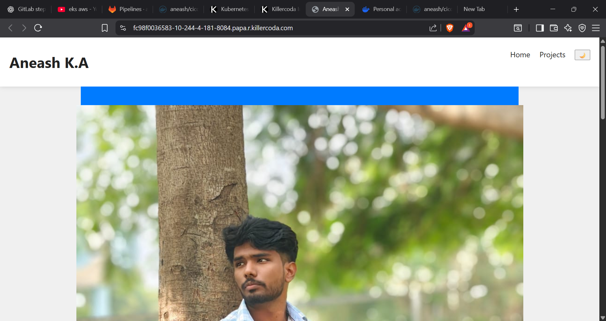
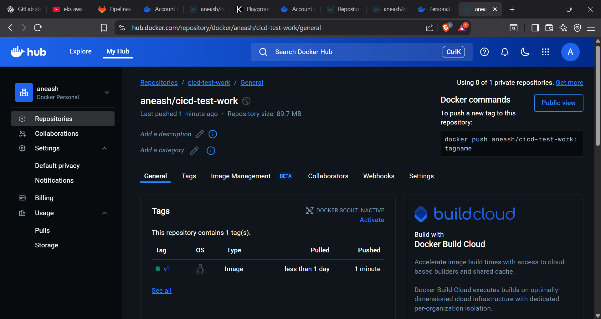
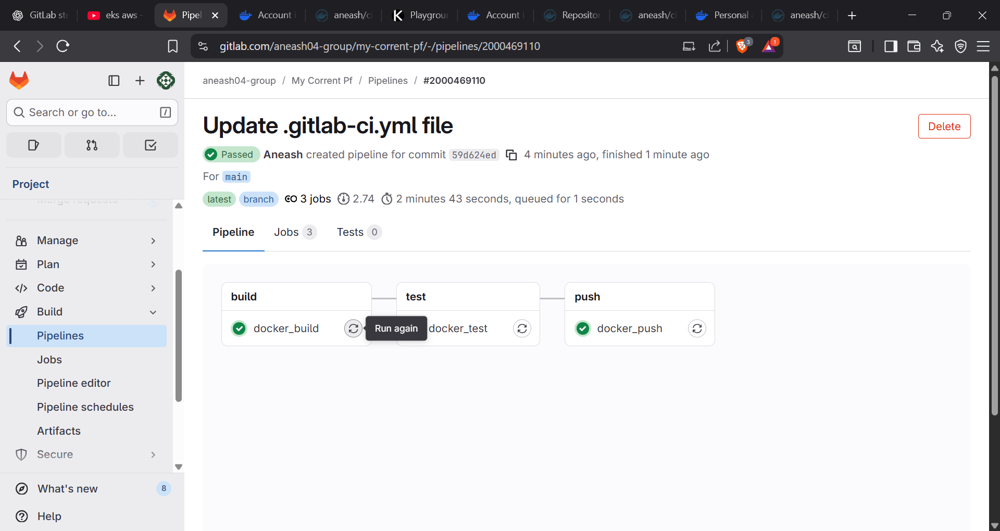
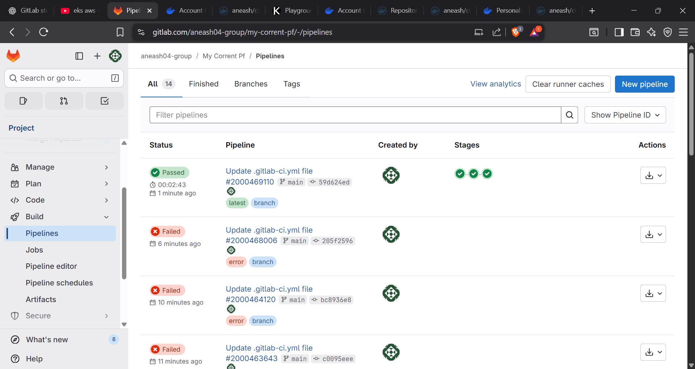

# Aneash K.A Portfolio



This is a personal portfolio website for Aneash K.A, a DevOps and AWS Cloud enthusiast. The site showcases skills, projects, and provides a simple, responsive design using HTML, CSS, and JavaScript, served via Nginx in a Docker container.




## Features
- **Home Page:** Introduction, about, and skills section.
- **Projects Page:** Highlights key projects with links to source code.
- **Responsive Design:** Works on desktop and mobile.
- **Theme Toggle:** Switch between light and dark mode.
- **Dockerized:** Easily deployable using Docker and Nginx.

## Technologies Used
- HTML5, CSS3, JavaScript (Vanilla)
- Nginx (as web server)
- Docker

## Getting Started

### Prerequisites
- [Docker](https://www.docker.com/get-started) installed on your machine.

### Running Locally
1. Clone the repository:
   ```sh
   git clone https://github.com/Aneash03/my-corrent-pf.git
   cd my-corrent-pf
   ```
2. Build and run the Docker container:
   ```sh
   docker build -t my-portfolio .
   docker run -p 8080:80 my-portfolio
   ```
3. Open your browser and go to [http://localhost:8080](http://localhost:8080)

## Project Structure
```
my-corrent-pf/
├── Dockerfile
├── index.html
├── nginx.conf
├── projects.html
├── script.js
├── style.css
```

## About
Aneash K.A is a passionate Cloud enthusiast currently pursuing studies in Computer Science. Specializes in AWS (EC2, S3, VPC, Route 53) and enjoys building scalable, secure cloud solutions.

## License
This project is open source and available under the [MIT License](LICENSE).
